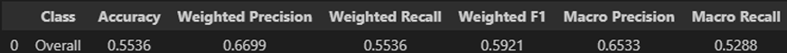

# ELEC 4840 – AI for Medical Images (Assignment 2)

This repository contains two deep learning projects completed for **ELEC 4840: AI for Medical Images** at HKUST.  
Both tasks apply computer vision and deep learning techniques to real-world medical imaging problems.

---

## Projects Overview

| Problem | Title | Summary |
|--------|-------|---------|
| Q1 | [Retinal Image Grading using CLIP](./hw2q1) | Used pretrained CLIP model to classify diabetic retinopathy severity via prompt-based zero-shot learning |
| Q2 | [Spleen CT Segmentation using 3D U-Net](./hw2q2) | Applied a 3D U-Net model to segment spleen regions from `.nii.gz` CT volumes |

---

## My Focus Areas

-  OCR in retinal imaging using **CLIP + prompt engineering**
-  3D semantic segmentation with **Dice + CE hybrid loss**
-  Extensive **performance analysis**: AUROC, Dice, Jaccard, 95HD, Specificity, NPV
-  Hands-on with **PyTorch**, **TensorBoard**, **Colab**, and **medical image visualization (ITK-SNAP)**

---

## Technologies Used

- PyTorch, TensorFlow, NumPy, Matplotlib
- CLIP model (ViT-B/32), U-Net (3D)
- TensorBoard for training logs
- `.nii.gz` medical imaging format (ITK-SNAP for visualization)

---
## Visualization
### Q1
### Pretrained model result

### Finetuned model result

### Q2

ITK Snap screenshot of Test image, test mask(Blue color) and 
prediction of test mask (Red color). Overlap area was represented by Purple color
---

## Course Info

-  **Course**: ELEC 4840 – AI for Medical Image Analysis  
-  **Institution**: HKUST  
-  **Student**: Lee Gyumin (이규민)  
-  **Term**: Spring 2025  
